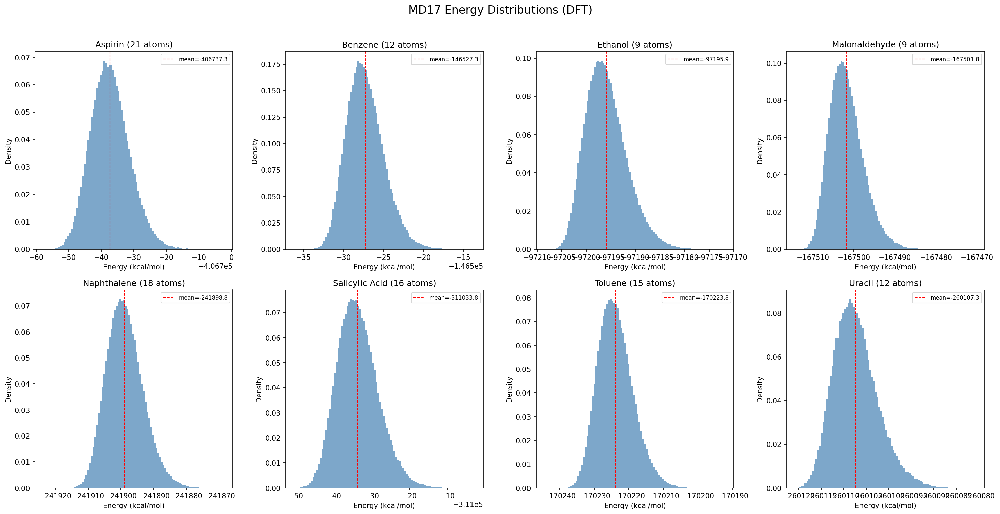
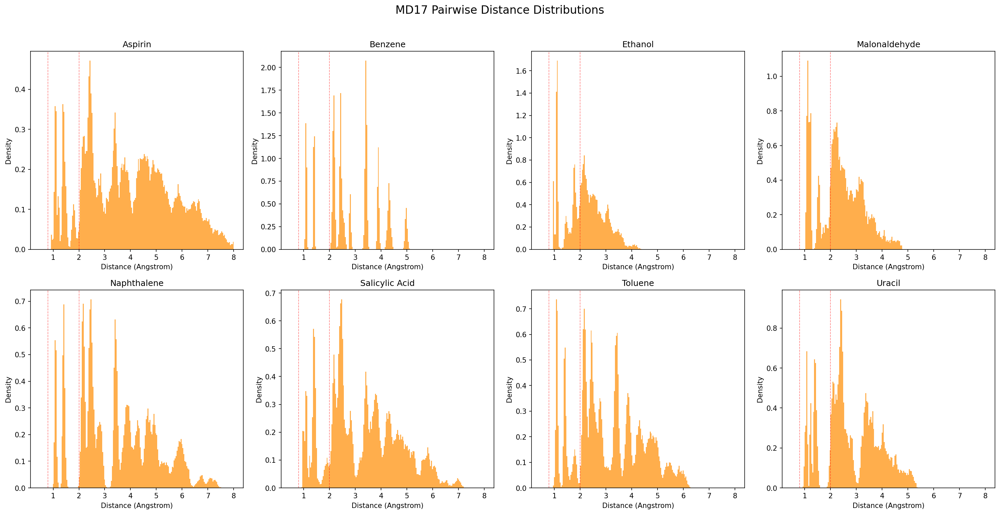
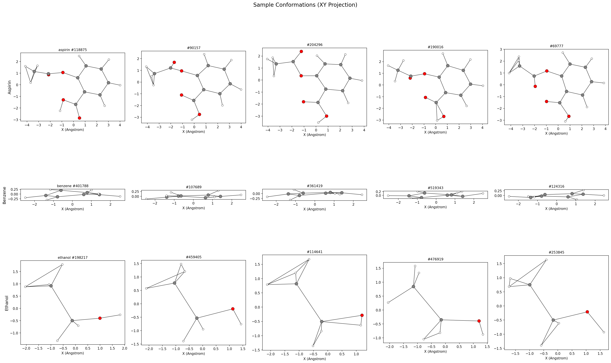
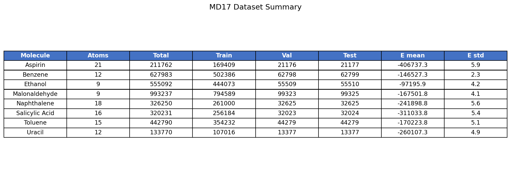

## [hyp_001] -- MD17 Data Pipeline
**Date:** 2026-02-28 | **Type:** Hypothesis | **Tag:** `hyp_001`

### Motivation
This is the data foundation for the entire TNAFMOL project. All downstream experiments (TarFlow, DDPM, head-to-head comparison) depend on having correctly preprocessed molecular conformations in canonical frame representation. Getting this right is critical -- a preprocessing error here silently corrupts every downstream result.

### Method
1. Download MD17 for all 8 molecules (aspirin, benzene, ethanol, malonaldehyde, naphthalene, salicylic acid, toluene, uracil)
2. Canonical frame preprocessing:
   - Subtract center of mass per conformation
   - Compute mean structure per molecule
   - Kabsch alignment to mean structure (principal axis alignment)
   - Pad to max atom count (21) with attention mask
3. One-hot atom type encoding (H, C, N, O)
4. 80/10/10 train/val/test split per molecule
5. Compute reference statistics: energy distributions, pairwise distance distributions, bond lengths
6. Save in CLAUDE.md-compliant data directory structure with metadata.json and ref_stats.pt

### Results

All 8 MD17 molecules downloaded and preprocessed successfully.

| Molecule | Atoms | Samples | Train | Val | Test | E mean (kcal/mol) | E std |
|----------|-------|---------|-------|-----|------|-------------------|-------|
| Aspirin | 21 | 211,762 | 169,409 | 21,176 | 21,177 | -406,737 | 5.9 |
| Benzene | 12 | 627,983 | 502,386 | 62,798 | 62,799 | -146,527 | 2.3 |
| Ethanol | 9 | 555,092 | 444,073 | 55,509 | 55,510 | -97,196 | 4.2 |
| Malonaldehyde | 9 | 993,237 | 794,589 | 99,323 | 99,325 | -167,502 | 4.1 |
| Naphthalene | 18 | 326,250 | 261,000 | 32,625 | 32,625 | -241,899 | 5.6 |
| Salicylic acid | 16 | 320,231 | 256,184 | 32,023 | 32,024 | -311,034 | 5.4 |
| Toluene | 15 | 442,790 | 354,232 | 44,279 | 44,279 | -170,224 | 5.1 |
| Uracil | 12 | 133,770 | 107,016 | 13,377 | 13,377 | -260,107 | 4.9 |

**Atom types present:** H, C (all molecules); N, O (uracil has all 4; most have H, C, O).

**MD17 energy distributions** -- Histograms of DFT energies for all 8 molecules. All show smooth, roughly Gaussian thermal distributions centered at the mean DFT energy. Standard deviations range from 2.3 (benzene, rigid) to 5.9 kcal/mol (aspirin, most flexible).

**Pairwise distance distributions** -- For each molecule, the distribution of all atom-pair distances across 1000 subsampled conformations. Sharp peaks at ~1.1 Angstrom (C-H bonds) and ~1.4 Angstrom (C-C bonds) are expected and present. The red dashed lines mark 0.8 and 2.0 Angstrom (validity bounds).

**Sample conformations (XY projection)** -- 5 random conformations per molecule for aspirin, benzene, and ethanol. Aspirin shows a complex aromatic + ester group structure. Benzene is planar (as expected for an aromatic ring). Ethanol shows conformational flexibility in the OH group.

**Dataset summary table** -- Overview of all 8 molecules with atom counts, sample sizes, and energy statistics.

### Verification

- **Mass-weighted CoM offset:** < 4e-8 Angstrom for all molecules (effectively zero)
- **Padding:** Confirmed zero positions for padding atoms
- **Atom type encoding:** Confirmed correct for all 4 types (H=0, C=1, N=2, O=3)
- **Split consistency:** Train + val + test = total for all molecules
- **Energy ranges:** Consistent with DFT-level calculations (~100k-400k kcal/mol scale)
- **Pairwise distances:** All bond peaks at physically expected locations (C-H ~1.09, C-C ~1.40)

### Interpretation
The data pipeline is complete and verified. All 8 MD17 molecules are preprocessed into canonical frame with correct centering, alignment, padding, and atom type encoding. The reference statistics and verification plots confirm data quality. This dataset is ready for downstream model training (hyp_002 TarFlow, hyp_003 DDPM).

**Status:** [x] Fits | [ ] Conflict | [ ] Inconclusive
