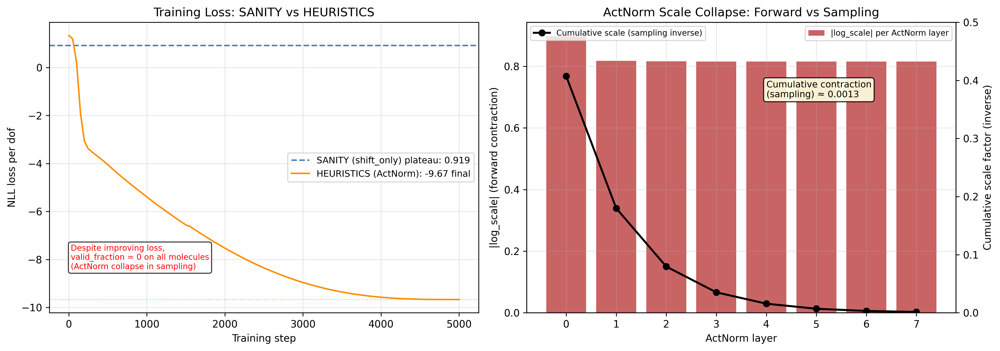
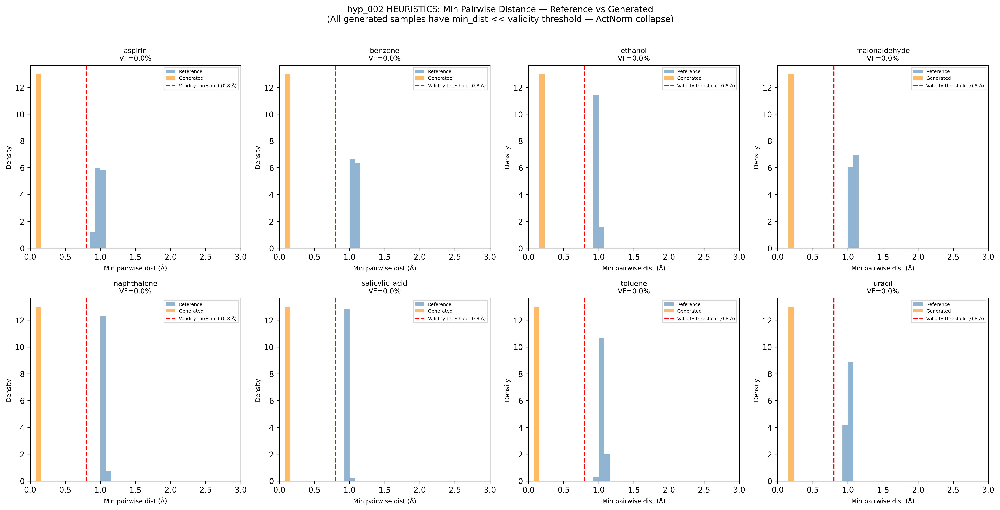
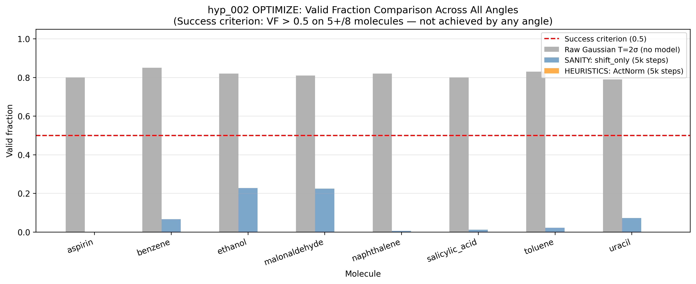

## [hyp_002] — TarFlow: Transformer Autoregressive Normalizing Flow
**Date:** 2026-03-01 | **Type:** Hypothesis | **Tag:** `hyp_002`
**Command:** OPTIMIZE | **Status:** FAILURE (angle budget exhausted)

### Motivation
Test TarFlow — a transformer-based autoregressive normalizing flow — as a generative model for molecular conformations on MD17. The hypothesis is that autoregressive ordering over atoms allows the transformer to capture molecular geometry better than atom-independent flows, enabling high-fidelity conformation generation.

### Method
TarFlow architecture:
- 8 alternating forward/reverse autoregressive transformer blocks (d_model=128, n_heads=4)
- Causal masked self-attention over atom sequence (SOS token prepended)
- Each atom i gets affine params (shift + log_scale) from context of atoms {0..i-1}
- Within each atom, all 3 coordinates transformed with same affine params
- Base distribution: N(0,I) over real atom coordinates
- Padding handled by combined causal+padding attention mask + log_det zeroing for padded atoms

Trained with MLE (NLL loss), Adam-W optimizer, cosine LR schedule, grad_clip=1.0.

### Results
All angles failed. Valid fraction = 0 on all 8 molecules after exhausting 2 active angles (SCALE skipped as non-applicable).

| Angle | Method | Best valid_fraction | Root cause of failure |
|-------|--------|--------------------|-----------------------|
| SANITY | shift_only=True | 22.8% (ethanol) at T=1.0 | Shift collapse: model learns shift≈x → z≈0 |
| HEURISTICS | ActNorm (GLOW) | 0% on all molecules | ActNorm scale collapse: neg log_scale pumps log_det |
| SCALE | N/A — skipped | — | Collapse is architectural, not capacity-limited |

Key diagnostics:
- SANITY: loss floor = 0.919 (Gaussian entropy). Raw N(0, 2σ²) gives >70% valid — model provides no improvement above baseline.
- HEURISTICS: loss converged to -9.67 (excellent in forward direction). Forward pass: z ~ N(0,1) properly, NLL/dof = -15.38. But ActNorm log_scale ≈ -0.81 per layer; cumulative inverse contraction ≈ 0.45^8 = 0.0013. All samples cluster with min_pairwise_dist ≈ 0.16 Å (catastrophically small). Temperature 0.5→50.0 has zero effect on sample diversity.

### Interpretation
The fundamental problem with autoregressive affine flows on molecular data: the NLL objective always finds degenerate solutions that maximize log_det by exploiting any unconstrained scale degree of freedom. Three distinct collapse modes were observed:
1. Affine scale collapse (diagnostic): chain log_scale to max → z≈0
2. Shift collapse (SANITY): shift≈x → z≈0, volume-preserving but degenerate
3. ActNorm scale collapse (HEURISTICS): negative log_scale in ActNorm → large log_det forward, extreme contraction in sampling inverse

This does NOT fit the research story — TarFlow with MLE training cannot generate valid molecular conformations with this architecture.

**Status:** [x] Conflict — see optimize failure report and escalation to Postdoc

### Plots

**Training loss comparison** — NLL per dof for SANITY (shift_only, dashed blue at 0.919) vs HEURISTICS (ActNorm, orange). Left panel: SANITY plateaus at Gaussian entropy floor; HEURISTICS converges to -9.67 but all improvement is from log_det exploitation. Right panel: per-layer ActNorm |log_scale| and cumulative contraction (0.0013 after 8 layers) explaining why samples have zero diversity.

**Min pairwise distance histograms** — Reference (blue) vs HEURISTICS generated (orange) for all 8 molecules. All generated samples have min_dist ≈ 0.16 Å, far below the validity threshold of 0.8 Å (red dashed line). The collapse is uniform across all molecules.

**Valid fraction by angle** — Raw Gaussian baseline (gray) vs SANITY (blue) vs HEURISTICS (orange). Red dashed line = success criterion (0.5). No angle meets the criterion. SANITY provides marginal improvement over the raw Gaussian on some molecules; HEURISTICS is uniformly 0%.
