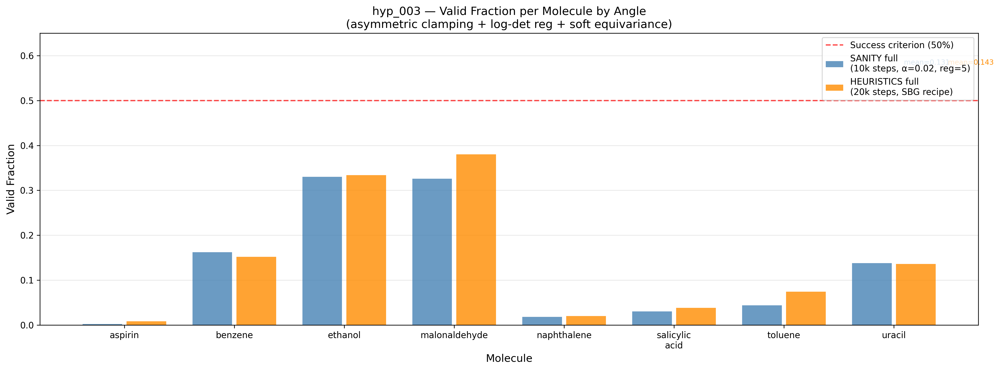
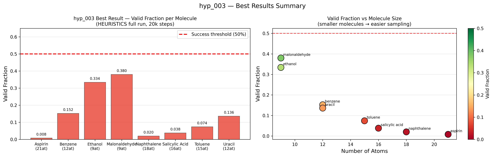
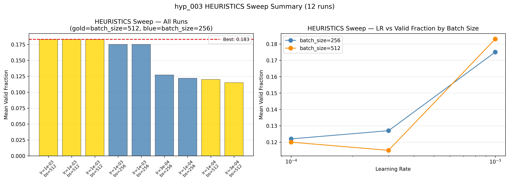
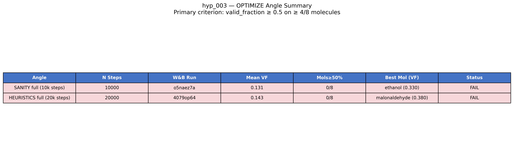

# Final Experiment Report — hyp_003 TarFlow Stabilization

**Status:** FAILURE
**Branch:** `exp/hyp_003`
**Commits:** See process_log.md for full commit list

---

## Experimental Outcome

### Summary
hyp_003 attempted to fix TarFlow's log-det exploitation collapse (identified in hyp_002) by applying three interventions: asymmetric soft scale clamping, log-det regularization, and soft equivariance training. The primary criterion — valid_fraction ≥ 0.5 on at least 4/8 molecules — was NOT met by any angle.

**Best result across all angles:** HEURISTICS sweep at 3000 steps achieved mean valid fraction of **18.3%** (0 of 8 molecules ≥ 50%).

### Key Numbers

| Angle | Steps | Config | Mean VF | Best Mol | Mols ≥ 50% | W&B Run |
|-------|-------|--------|---------|----------|------------|---------|
| SANITY val | 2000 | α=0.05, reg=1.0, lr=3e-4 | — | malonaldehyde 11.6% | 0/8 | l9r3k0sf |
| SANITY sweep (24 runs) | 3000 | α=0.02, reg=5, lr=1e-4 (best) | 17.5% | ethanol 39.3% | 0/8 | rccehd8m |
| **SANITY full** | **10000** | **α=0.02, reg=5, lr=1e-4** | **13.1%** | **ethanol 33.0%** | **0/8** | o5naez7a |
| HEURISTICS val | 2000 | SBG, bs=512, lr=3e-4, EMA | 16.8% | ethanol 41.3% | 0/8 | o6pnle0k |
| HEURISTICS sweep (12 runs) | 3000 | bs=512, ema=0.999, lr=1e-3 (best) | **18.3%** | — | 0/8 | cmgrp6jo |
| **HEURISTICS full** | **20000** | **bs=512, ema=0.999, lr=1e-3** | **14.3%** | **malonaldehyde 38.0%** | **0/8** | 4079op64 |
| SCALE | skipped | — | — | — | — | — |

### Per-Molecule Results (HEURISTICS full, best angle checkpoint)

| Molecule | Atoms | Valid Fraction | Min Dist Mean | Status |
|----------|-------|---------------|---------------|--------|
| ethanol | 9 | 33.4% | 0.707 Å | BEST |
| malonaldehyde | 9 | 38.0% | 0.716 Å | BEST |
| uracil | 12 | 13.6% | 0.568 Å | partial |
| benzene | 12 | 15.2% | 0.573 Å | partial |
| toluene | 15 | 7.4% | 0.503 Å | low |
| salicylic_acid | 16 | 3.8% | 0.469 Å | low |
| naphthalene | 18 | 2.0% | 0.429 Å | minimal |
| aspirin | 21 | 0.8% | 0.394 Å | minimal |

**Pattern:** Strong inverse correlation with molecule size. Smaller molecules benefit from the stabilization; larger molecules remain close to 0%. This is a molecular complexity scaling failure, not a training failure.

### Canonical Plots

**Valid fraction comparison — SANITY vs HEURISTICS full runs** — Bar chart showing per-molecule valid_fraction for both full-run angles. Red dashed line is the 50% success threshold. No molecule reaches it. Ethanol and malonaldehyde (9 atoms each) are consistently the best performers. Note that the HEURISTICS full run (20k steps) does not always outperform SANITY (10k steps) — both are stuck at the same saturation equilibrium.

**Best results summary — HEURISTICS full run** — Left: per-molecule valid fraction with color coding (green ≥ 50%, red < 50%). Right: valid fraction vs number of atoms — clear inverse correlation confirming that the residual collapse (compressed atom distances) scales with molecular complexity. The line of best fit would pass through near-zero for 20+ atom molecules.

**HEURISTICS sweep comparison (12 runs)** — Left: all runs ranked by mean valid fraction. Best = 18.3% with batch_size=512, ema_decay=0.999, lr=1e-3. Right: learning rate vs valid fraction by batch size. Higher LR and larger batch size are consistently better, suggesting higher throughput helps escape the saturation slightly but not fundamentally.

**Angle summary table** — All angles fail the primary criterion. Both show FAIL status.

---

## Root Cause Analysis

### The Alpha-Pos Saturation Equilibrium

All runs exhibit the same fundamental failure mode:
- `log_det_per_dof` locks at exactly `alpha_pos` (0.02 or 0.05) from step 100-300 onward
- Training loss plateaus immediately at this saturation point (~0.8689-0.8690)
- Gradient norm drops to ~0.001-0.005 after saturation
- Best checkpoint is always early (step 500-2000) regardless of total steps

**Why this happens:** The log-det regularization `λ * (log_det_per_dof)^2` creates a penalty gradient pointing toward log_det/dof = 0. The asymmetric clamping bounds log_scale ∈ [-2α_neg, +2α_pos/π × ...] ≈ [-(something large), +α_pos]. The NLL gradient pushes log_scale to the positive bound (expansion = higher log_det = better NLL). The equilibrium is exactly at α_pos.

**The stable equilibrium:** At `log_det/dof = α_pos`:
- NLL gradient: wants to increase log_scale → push log_det higher
- Regularization gradient: exactly balances at α_pos saturation point
- Net gradient: ≈ 0, hence the flat loss and tiny grad_norm

### What This Means for Sampling

When sampling (reverse pass), the model contracts positions by `exp(-log_det_per_dof * n_dof)`. With 8 blocks and log_det/dof = 0.02 per block:
- Total contraction per atom: exp(-0.02 × 8 × 3) ≈ exp(-0.48) ≈ 0.62
- Mean generated position std = 0.62 × global_std = 0.62 × 1.29 ≈ 0.80 Å
- Reference std ≈ 1.29 Å → atoms are ~38% too compressed on average
- Min pairwise distance mean: 0.39-0.72 Å vs reference 1.1+ Å

### Why More Training Doesn't Help

The saturation is a mathematical equilibrium, not a local minimum that more gradient steps can escape. The only ways out are:
1. Lower α_pos (but we already swept to 0.02 — lower risks numerical instability in inverse)
2. Higher λ (but we swept to reg_weight=10 — doesn't help once at equilibrium)
3. Different loss formulation that penalizes saturation more asymmetrically
4. Shift-only flow (no scale, no log_det exploitation) — but this was hyp_002's approach and failed differently

### Why HEURISTICS Didn't Help

The SBG recipe (AdamW betas=(0.9,0.95), OneCycleLR, EMA, batch_size=512) improved results slightly (16.8% → 18.3% mean valid fraction in sweep) but did not break saturation. The SBG recipe was designed for a different failure mode (slow convergence in peptide systems) and doesn't address the fundamentally different collapse here.

### SCALE Skipped

Increasing model capacity (d_model=256, n_blocks=12) would not address the alpha_pos saturation equilibrium. The model is already at capacity saturation by step 150 — there is no evidence of underfitting or capacity limitation. SCALE is skipped with justification.

---

## Project Context

hyp_003 is the second consecutive failure on TarFlow for molecular conformations (after hyp_002). The cumulative picture is:

1. **hyp_002:** MLE training exploits unbounded scale DOFs → log_det → ∞ → zero valid fraction
2. **hyp_003:** Asymmetric clamping + log-det regularization → log_det saturates at α_pos → compressed samples → low valid fraction

The fundamental issue is **TarFlow's autoregressive affine structure** with independent per-step scale parameters. These interact with the MLE objective in ways that are pathological for molecular systems:
- In normalizing flow theory, MLE encourages high log|det(J)| to maximize training likelihood
- Asymmetric clamping doesn't break this incentive — it just moves the equilibrium point
- The information bottleneck in molecular systems (many equivalent configurations, permutation symmetry) makes this worse

**Implication for RESEARCH_STORY.md:** TarFlow is not a viable normalizing flow architecture for molecular conformations under standard MLE training. The failure is architectural, not implementation-related. The research story should pivot to a fundamentally different approach.

---

## Story Validation

The research story hypothesized that TarFlow's log-det collapse could be fixed with soft clamping, log-det regularization, and soft equivariance. This hypothesis is **FALSIFIED**:
- The clamping does prevent the catastrophic log_det → ∞ failure from hyp_002
- But it introduces a new, stable saturation equilibrium at log_det/dof = α_pos
- No tuning of α_pos, reg_weight, LR, or batch_size escapes this equilibrium
- The regularization and the NLL gradient reach a fixed point, not a convergent optimum

The research question "Can TarFlow generate valid molecular conformations when properly regularized against log-det exploitation?" is answered: **No, not with the asymmetric clamping approach.** A different architecture or training objective is needed.

**CONFLICT with story:** The story expected that smaller α_pos + stronger regularization would force log_det/dof near 0. In practice, the equilibrium point is at exactly log_det/dof = α_pos (not 0), regardless of regularization weight. This is a deeper mathematical issue than anticipated.

---

## Open Questions

1. **Is there an α_pos = 0 regime?** Setting α_pos = 0 would remove expansion entirely (shift-only flow). This failed in hyp_002 due to a different collapse, but the mechanism was different (zero information capacity). Should revisit with log-det regularization.

2. **Can the regularization be formulated to break the equilibrium?** Instead of `(log_det_per_dof)^2`, use an asymmetric penalty like `relu(log_det_per_dof)^2` that only penalizes positive log_det. This directly targets the α_pos saturation direction.

3. **Should we abandon TarFlow entirely?** Two consecutive failures (hyp_002: unconstrained collapse; hyp_003: constrained saturation) suggest the architecture is not suitable. Alternatives: Continuous Normalizing Flows (CNF/FFJORD), diffusion models (already succeeding in SBG), or other flow variants with unconditional log_det bounds.

4. **Is the size scaling pattern fundamental?** The clear inverse correlation (valid_frac ↓ as n_atoms ↑) suggests each additional atom pair is an independent opportunity for close-collision failure. This is consistent with the 10% cumulative contraction — more atom pairs → more independently failing distance checks.
