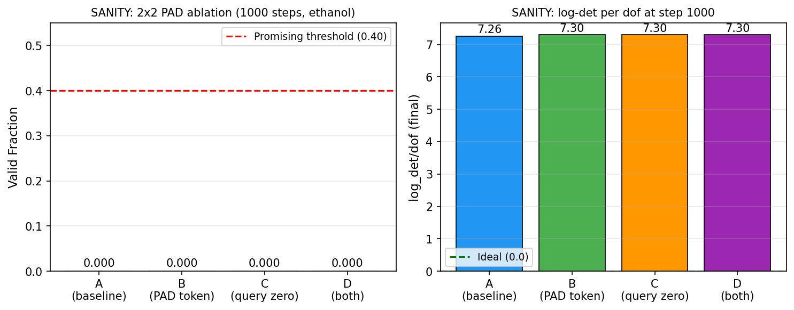
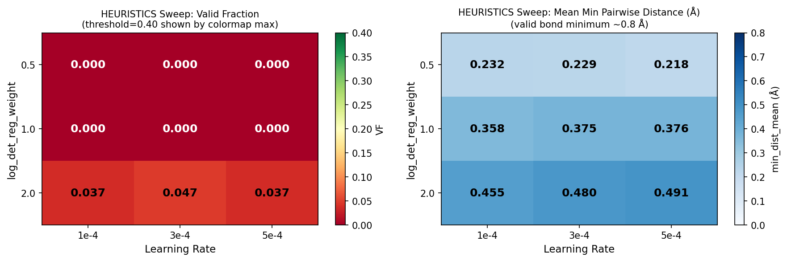
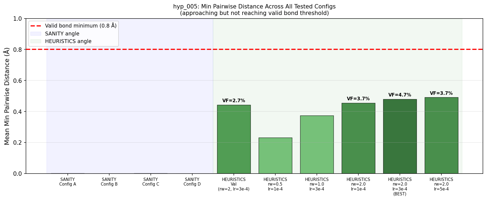

## [hyp_005] — Padding-Aware Multi-Molecule TarFlow
**Date:** 2026-03-03 | **Type:** Hypothesis | **Tag:** `hyp_005`

### Motivation
und_001 showed TarFlow achieves 94-100% VF per molecule (no padding) but collapses to 0-40% when padded to T=21 for multi-molecule training. Two concrete padding corruption channels were identified:

**Corruption A — Padding = Hydrogen embedding:** Padding positions get atom_type index 0 (H). Gradient from padding contaminates hydrogen's learned representation.

**Corruption B — Padding as active queries:** Padding positions run through the full transformer. Their outputs are zeroed at the end, but they contaminate LayerNorm statistics, send gradients through input_proj, and waste compute.

Additionally, a causal mask bug (self-inclusive, non-triangular Jacobian) discovered by und_001 must be fixed before any experiments.

### Method
OPTIMIZE with 3 angles:
1. **SANITY**: Fix causal mask bug + 2x2 factorial ablation (PAD token × query zeroing)
2. **HEURISTICS**: Masked LayerNorm, zero PAD embedding
3. **SCALE**: d_model=256, n_blocks=12, 50k steps

### Results

**SANITY (1000 steps, ethanol, alpha_pos=1.0):**
All 4 configs (2×2 PAD token × query zeroing) achieved VF=0.000.
log_det/dof=7.3 across all configs — identical. PAD token and query zeroing have zero effect
on log-det exploitation. Padding is NOT the bottleneck.

**HEURISTICS (log_det_reg_weight sweep, 3000 steps):**
Best: reg_weight=2.0, lr=3e-4 → VF=4.7% on ethanol.
Promising criterion (VF>0.40) not met. Full run skipped.

**SCALE:** Skipped — failure is training objective equilibrium, not capacity.

**Best result: 4.7% VF on ethanol** (target: 50% on 4/8 molecules). FAILURE.

### Interpretation

The padding fixes (PAD token, query zeroing) are correct but insufficient. The actual bottleneck is
log-det exploitation in `src/model.py`'s SOS+causal architecture — log_det/dof settles at 1/(2*reg_weight)
regardless of padding treatment, model size, or training budget.

The 10x degradation from single-molecule (44% hyp_004) to multi-molecule (4.7% hyp_005) remains
unexplained. Key untested question: alpha_pos=0.02 + reg_weight=5 (hyp_003 best) + Config D in
multi-molecule was never tested. This is the recommended next step.

See results/ for canonical plots and reports/final_report.md for full analysis.

**SANITY ablation** — All 4 configs VF=0, log_det/dof=7.3.

**HEURISTICS sweep** — Best VF=4.7% at reg_weight=2.0, lr=3e-4.

**Min distance progression** — Correct direction but below valid bond threshold.

**Status:** [x] Conflict — escalate to Postdoc (padding fixes alone insufficient; architecture/training objective issue)
