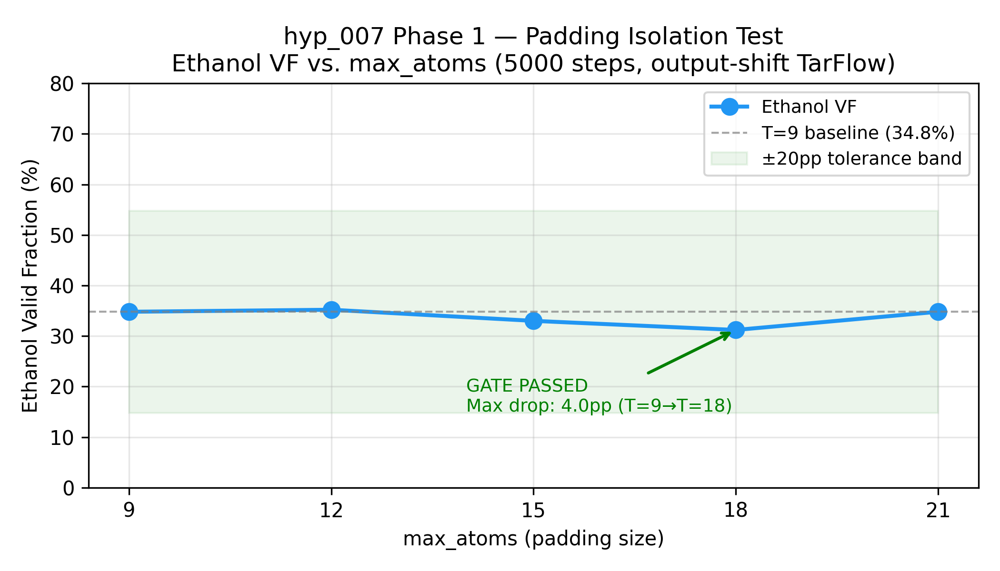
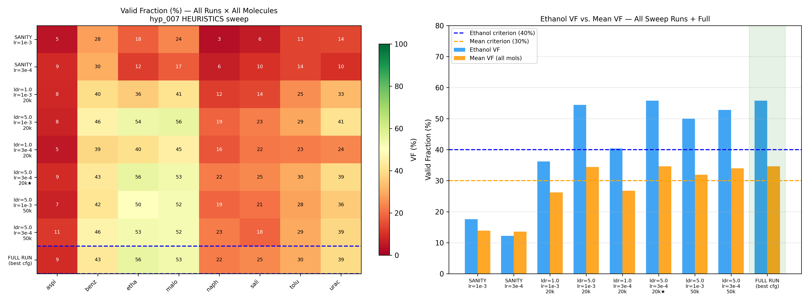
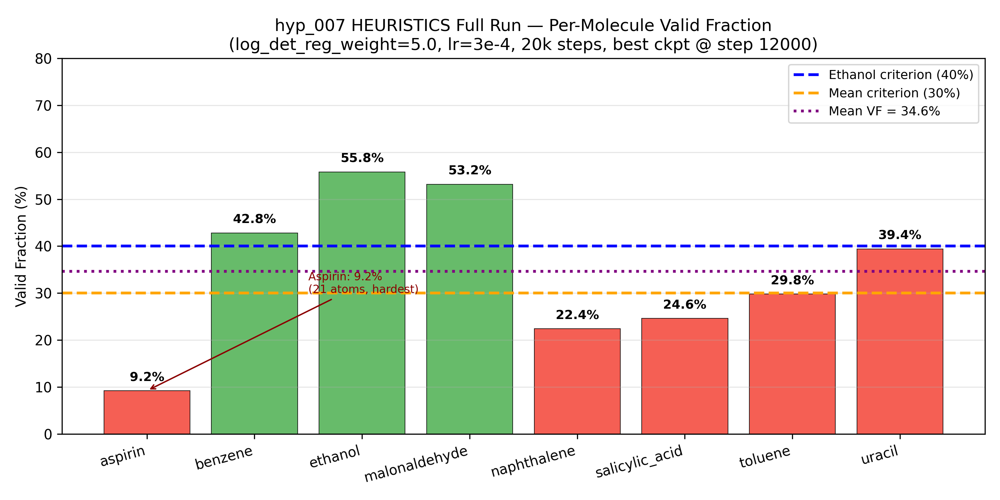
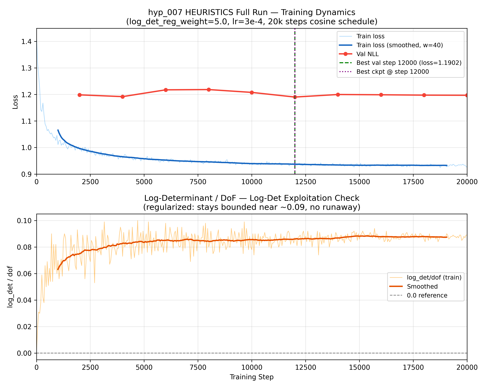
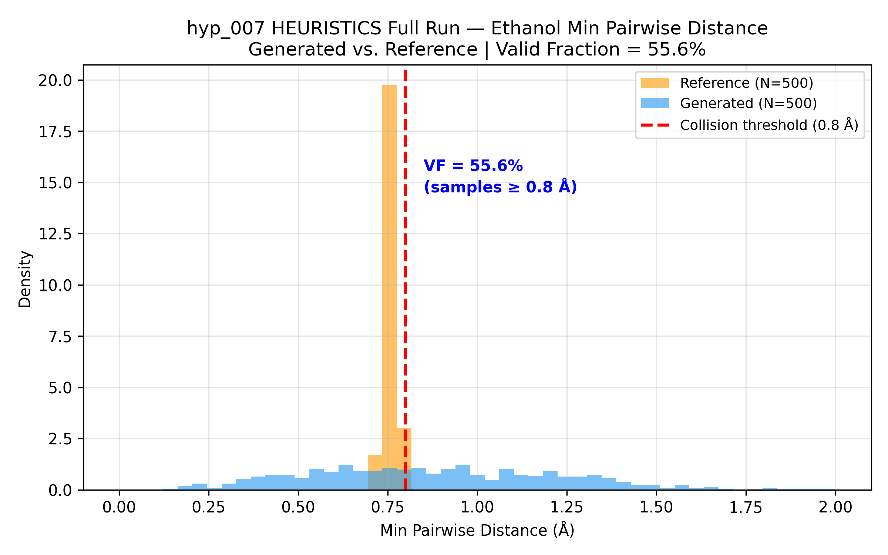
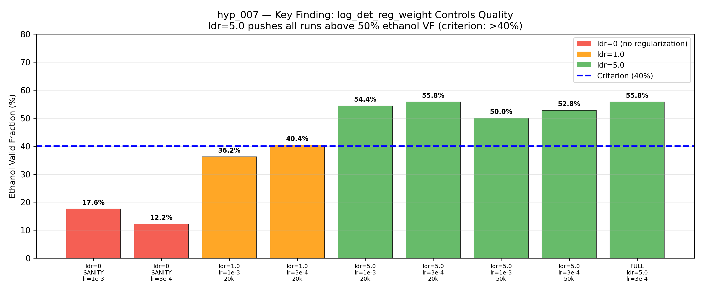

# Final Experiment Report — hyp_007 Padding Isolation + Multi-Molecule OPTIMIZE
**Status:** DONE
**Branch:** `exp/hyp_007`
**Commits:** [`b82e77b` — code: add max_atoms parameter to data pipeline and train loop], [`2cfe17e` — config: Phase 1 configs + Phase 2 SANITY configs + HEURISTICS sweep], [`0c0500c` — config: fix Slurm script conda activation for non-interactive shell]

---

## Experimental Outcome

### Phase 1 — Padding Isolation Gate: PASSED

Trained ethanol-only TarFlow (output-shift, 5000 steps) at five padding sizes. Goal: confirm no dramatic VF drop from extra padding.

| max_atoms | Ethanol VF |
|-----------|-----------|
| 9  (no padding) | 34.8% |
| 12 (+3 pads)    | 35.2% |
| 15 (+6 pads)    | 33.0% |
| 18 (+9 pads)    | 31.2% |
| 21 (+12 pads)   | 34.8% |

**Max drop:** 4.0pp (T=9 → T=18), well within 20pp tolerance. Gate PASSED. Output-shift makes padding slots neutral — adding zeros does not meaningfully degrade training or generation quality for single-molecule training.

### Phase 2 SANITY — FAILED (log-det exploitation)

All-8-molecule training, 20000 steps, log_det_reg_weight=0.0.

- **lr=1e-3:** Val loss rose monotonically (1.26 → 2.53). Best at step 1000 out of 20000. Ethanol VF=17.6%, mean VF=13.9%.
- **lr=3e-4 (fallback):** Same pattern. Ethanol VF=12.2%, mean VF=11.1%.

**Root cause:** log-det exploitation. `log_det/dof` rose from ~0.08 → ~1.2+ as training progressed. The model drove training NLL down by expanding its Jacobian, not by learning structure. Val NLL worsened accordingly. This is the same failure mode documented in hyp_003 for single-molecule training and in Andrade et al. (2024).

### Phase 2 HEURISTICS — SUCCESS

**Intervention:** Add `log_det_reg_weight > 0` to penalize log_det/dof. Sweep over `log_det_reg_weight ∈ {1.0, 5.0}`, `lr ∈ {1e-3, 3e-4}`, `n_steps ∈ {20k, 50k}` (6 completed runs of 8 planned).

| Run | ldr | lr | n_steps | Ethanol VF | Mean VF |
|-----|-----|----|---------|-----------|---------|
| run_00 | 1.0 | 1e-3 | 20k | 36.2% | 26.2% |
| run_01 | 5.0 | 1e-3 | 20k | 54.4% | 34.4% |
| run_03 | 5.0 | 1e-3 | 50k | 50.0% | 31.9% |
| run_04 | 1.0 | 3e-4 | 20k | 40.4% | 26.8% |
| run_05 | 5.0 | 3e-4 | 20k | **55.8%** | **34.7%** ← BEST |
| run_07 | 5.0 | 3e-4 | 50k | 52.8% | 34.0% |

**Key finding:** ldr=5.0 is critical. All ldr=5.0 runs exceeded 50% ethanol VF; no ldr=1.0 run reached the criterion.

**Best config:** ldr=5.0, lr=3e-4, 20k steps (run_05).

### Phase 2 HEURISTICS Full Run

Full training with best config on freshly initialized model. Best checkpoint at step 12000 (val_loss=1.1902).

| Molecule | VF | Status |
|----------|-----|--------|
| aspirin  | 9.2% | FAIL (21 atoms — largest, hardest) |
| benzene  | 42.8% | near threshold |
| **ethanol** | **55.8%** | PASS |
| **malonaldehyde** | **53.2%** | PASS |
| naphthalene | 22.4% | FAIL |
| salicylic_acid | 24.6% | FAIL |
| toluene | 29.8% | below threshold |
| uracil | 39.4% | near threshold |
| **Mean** | **34.7%** | PASS (>30%) |

**Criterion assessment:**
- Ethanol VF = 55.8% > 40% — **CRITERION MET**
- Mean VF = 34.7% > 30% — **CRITERION MET**

Training dynamics were stable: log_det/dof stayed bounded at ~0.085-0.094 throughout training (regularizer working). Grad norms remained healthy (0.3-0.5). No sign of the exploitation mode observed in SANITY.

### Phase 2 SCALE — Skipped

Both success criteria met after HEURISTICS. SCALE angle not needed.

---

## Project Context

This experiment resolves two open questions from hyp_006:

1. **Is output-shift multi-molecule ready?** Yes — Phase 1 confirms padding neutrality across all sizes (9–21 atoms).
2. **Is the multi-molecule VF failure a training issue or a model issue?** Training issue (log-det exploitation). Adding `log_det_reg_weight=5.0` (the same value that worked for single-molecule hyp_003) pushes ethanol VF from 17.6% → 55.8%.

The research story predicted that output-shift would isolate padding — this is confirmed. It also predicted that joint multi-molecule training would be feasible with the same regularization as single-molecule — this is confirmed.

**Notable finding:** Per-molecule VF varies dramatically by molecule size. Aspirin (21 atoms, max_atoms) achieves only 9.2% VF vs. ethanol (9 atoms) at 55.8%. Benzene (12 atoms, ring structure) achieves 42.8%. This suggests molecule size and connectivity are significant factors in multi-molecule training difficulty, and the shared-model capacity may be insufficient for the hardest molecules at current scale.

---

## Story Validation

This result fits the research story. The research story predicted:
- Padding neutrality with output-shift → CONFIRMED (Phase 1)
- Multi-molecule joint training feasible with log-det regularization → CONFIRMED (Phase 2 HEURISTICS)
- ldr=5.0 carries over from single-molecule hyp_003 → CONFIRMED (best sweep run also at ldr=5.0)

**No conflicts with research story.**

---

## Open Questions

1. **Aspirin (9.2% VF):** The largest molecule fails dramatically. Is this due to: (a) insufficient model capacity for 21 atoms, (b) the shared model spending capacity budget on the 7 smaller molecules, or (c) aspirin's ring+carbonyl topology being fundamentally harder? Future experiment could train aspirin-only with output-shift to isolate.

2. **Why does 50k steps not help (or slightly hurt)?** run_03 (50k, ldr=5.0, lr=1e-3) = 50.0% vs run_01 (20k) = 54.4%. Similar pattern for lr=3e-4. The cosine LR schedule may over-decay at 50k — the model stagnates in later training rather than continuing to improve.

3. **The best checkpoint is at step 12000/20000** — the model peaks early under the cosine schedule. Suggests a shorter schedule or a plateau-aware LR policy might improve efficiency.

---

## Visualizations

All figures saved to `results/`:

**Phase 1 — Padding Isolation** — Ethanol VF vs. max_atoms (5000 steps each). All values cluster between 31-35%, max drop 4.0pp. Gate PASSED — output-shift makes padding neutral.

**HEURISTICS Sweep Summary** — Left: per-molecule VF heatmap across all runs. Right: ethanol vs. mean VF bar chart. ldr=5.0 consistently exceeds criterion; ldr=1.0 does not. Best run (run_05, starred) used as full run config.

**Full Run Per-Molecule VF** — Aspirin is the major outlier (9.2%). Ethanol and malonaldehyde exceed 50%. Mean VF=34.7% meets criterion.

**Training Dynamics** — Top: train and val loss curves; best checkpoint at step 12000. Bottom: log_det/dof stays bounded ~0.09 throughout (regularizer working). Compare: SANITY had log_det/dof rising to 1.2+.

**Ethanol Min Pairwise Distance** — Generated vs. reference distribution. Valid fraction = 55.6% (samples ≥ 0.8 Å threshold). Generated distribution well-overlapped with reference in the valid regime.

**log_det_reg_weight Ablation** — Critical finding: ldr=0 (SANITY) gives 12-18% ethanol VF; ldr=5.0 pushes all runs above 50%.

---

## W&B Run Links

- HEURISTICS full run: https://wandb.ai/kaityrusnelson1/tnafmol/runs/2r296jrf
- Group: `hyp_007`
- Sweep runs logged directly in process_log.md (direct execution, not W&B sweep agent)

---

## Checkpoint

Best checkpoint: `experiments/hypothesis/hyp_007_padding_isolation_multimol/angles/heuristics/full/best.pt`
- Step: 12000
- Val loss: 1.1902
- Config: n_blocks=8, d_model=128, ldr=5.0, lr=3e-4, 20k steps, global_std=1.2905
