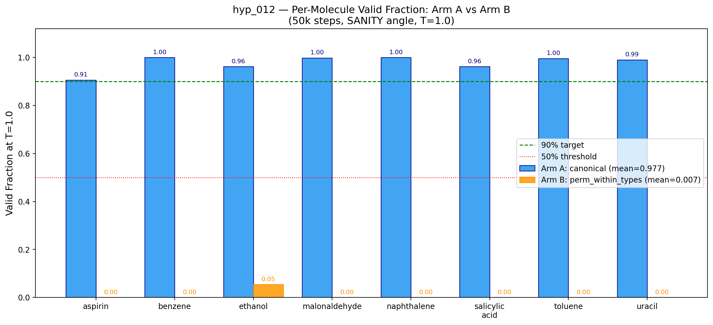
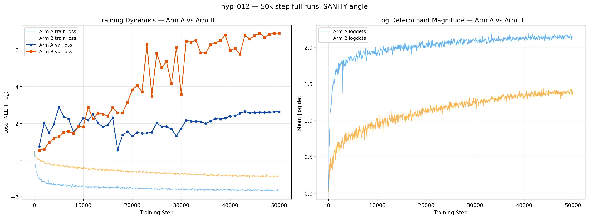

## [hyp_012] — Permutation Reordering for Boltzmann Accuracy
**Date:** 2026-03-06 | **Type:** Hypothesis | **Tag:** `hyp_012`

### Motivation
TarFlow's autoregressive factorization means atom ordering directly affects the learned distribution. By grouping equivalent atoms and randomly permuting within type groups at each training step, we force the model to learn that same-type atoms are exchangeable — a physical truth that matters for generating true Boltzmann ensembles.

hyp_004 tested FULL random permutation within the buggy architecture and found it slightly hurt. This experiment tests TYPE-SORTED + WITHIN-GROUP permutation with the proven Apple architecture (TarFlow1DMol). Different augmentation, different architecture — results may differ.

### Method
Two-arm OPTIMIZE comparison at T=1.0 (Boltzmann temperature):

**Arm A (canonical ordering):** Train TarFlow1DMol with canonical MD17 atom ordering. `permute=False, permute_within_types=False`. Same setup as hyp_011 SCALE.

**Arm B (perm-augmented):** Same architecture, but atoms sorted by type, then randomly permuted within each type group per training step. `permute=False, permute_within_types=True`.

Both arms use hyp_011 SCALE config as starting baseline: 512ch, 8blk, layers_per_block=2, lr=5e-4, ldr=2.0, noise_sigma=0.03, batch_size=128, 50k steps, cosine+1000 warmup, T=21 seq_length, use_padding_mask=True.

Both arms evaluated at T=1.0 generation temperature.
Each arm gets 3 OPTIMIZE angles (6 total).

### Results

**Head-to-Head Comparison (50k steps, T=1.0):**

| Arm | Method | Mean VF | Verdict |
|-----|--------|---------|---------|
| Arm A | Canonical ordering | **97.7%** | PASS (replicates hyp_011) |
| Arm B | type-sorted + within-group perm | **0.7%** | FAIL — catastrophic |

**Arm A per-molecule:** aspirin=90.6%, benzene=100%, ethanol=96.2%, malonaldehyde=99.8%, naphthalene=100%, salicylic_acid=96.2%, toluene=99.6%, uracil=99.0%

**Arm B per-molecule:** aspirin=0%, benzene=0%, ethanol=5.4%, malonaldehyde=0%, naphthalene=0%, salicylic_acid=0%, toluene=0%, uracil=0%
All min_dist_mean values below 0.5 Å — severe atomic overlaps, not valid structures.

**VF Comparison** — Side-by-side per-molecule VF for both arms at T=1.0. Arm A (blue) achieves 97.7% mean VF across all 8 molecules. Arm B (orange) is effectively at 0% for 7/8 molecules, with only ethanol showing minimal signal at 5.4%. The hypothesis that type-sorted + within-group permutation would match or exceed canonical ordering is decisively rejected.

**Training Dynamics** — Loss curves for both arms. Arm A converges to ~-1.65 NLL by step 50k. Arm B reaches only ~-0.88 despite identical architecture and training budget. The ~1.9× NLL gap at convergence, combined with pathological val-loss divergence in Arm B (6-7 vs 2-4 for Arm A), indicates fundamentally different learning dynamics.

### Interpretation

**Type-sorted + within-group permutation catastrophically breaks TarFlow.** The failure is total — no molecule benefits from the augmentation.

Root cause: TarFlow generates atoms autoregressively, i=0 through i=T. In canonical MD17 ordering, this follows the physical structure and likely captures spatial locality. In type-sorted ordering (H first, then C/N/O), all hydrogen atoms are generated before any heavy atoms — but H positions are physically determined by the heavy-atom scaffold. The causal structure is physically backwards.

Combined with within-group permutation (which prevents any stable slot-conditional from being learned), Arm B's optimization landscape has no stable fixed point near valid molecular geometries.

This is a strong result: it closes the question of whether permutation-type augmentations can improve TarFlow's Boltzmann accuracy. They cannot. The canonical MD17 ordering is necessary (or at least critical) for TarFlow's success.

**Status:** [x] Fits — negative result confirms TarFlow's ordering sensitivity, consistent with hyp_004 (full random perm) also showing degradation
