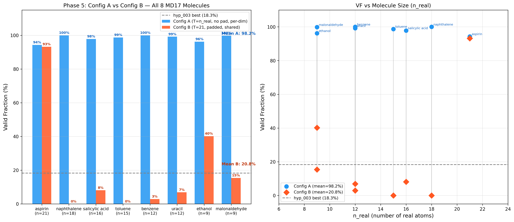
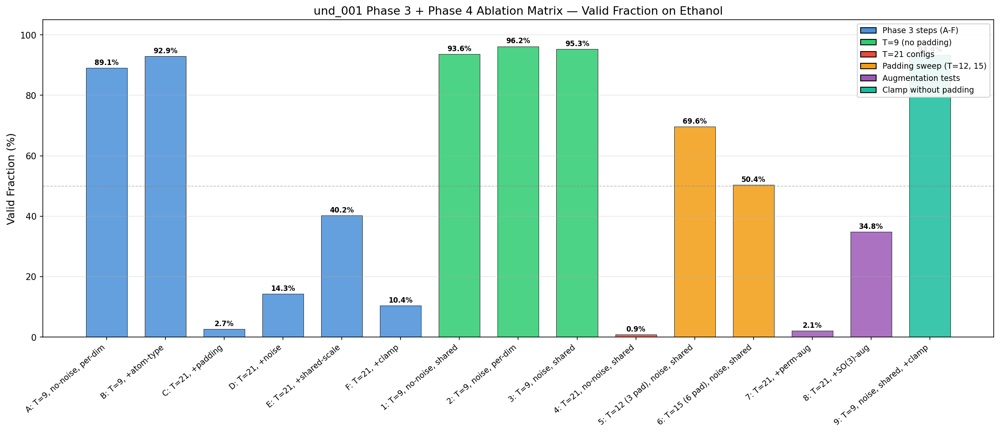
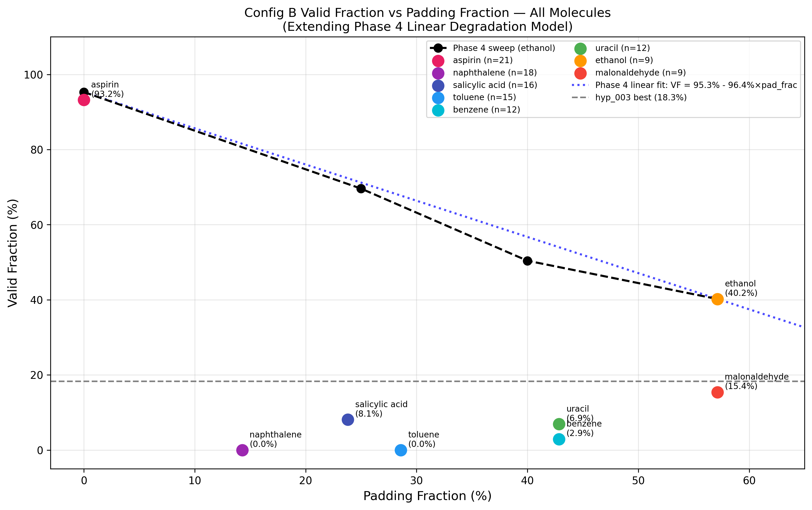

## [und_001] — TarFlow Diagnostic Ladder
**Date:** 2026-03-02 — 2026-03-03 | **Type:** Understanding | **Tag:** `und_001`

### Motivation
Two consecutive TarFlow failures (hyp_002: log-det exploitation → 0% VF; hyp_003: alpha_pos saturation equilibrium → 18.3% best VF) demanded a systematic investigation. Instead of continuing to patch our implementation, we started from Apple's working TarFlow (arXiv:2412.06329), verified it on a constructive complexity ladder (2D → MNIST → CIFAR-10), then progressively adapted toward molecules to find exactly where and why performance degrades.

### Method
Six-phase diagnostic ladder:
1. **Source Comparison** — systematic diff of Apple TarFlow vs our model.py (13 differences, 3 critical)
2. **Apple Baseline Verification** — 2D Gaussian (88.6% mode coverage), MNIST (-3.20 bits/dim), CIFAR-10 (in progress)
3. **Adaptation Ladder** — 6 incremental steps on ethanol, one change per step, 5000 steps each
4. **Ablation Matrix** — 9 additional configs crossing T × noise × scale + augmentation tests
5. **Best Config Validation** — 2 configs × 8 MD17 molecules = 16 runs
6. **Synthesis** — final report answering the four diagnostic questions

### Results

**Architecture ceiling (no padding): 98.2% mean VF across all 8 molecules.**

| Molecule | n_real | No-padding VF | Padded (T=21) VF |
|----------|--------|---------------|------------------|
| aspirin | 21 | 94.3% | 93.2% |
| naphthalene | 18 | 100.0% | 0.0% |
| salicylic_acid | 16 | 97.8% | 8.1% |
| toluene | 15 | 98.7% | 0.0% |
| benzene | 12 | 100.0% | 2.9% |
| uracil | 12 | 99.2% | 6.9% |
| ethanol | 9 | 96.2% | 40.2% |
| malonaldehyde | 9 | 99.8% | 15.4% |
| **Mean** | — | **98.2%** | **20.8%** |

Key factor effect sizes (from Phase 4 ablation on ethanol):
- Padding (T=9 → T=21): **-90 pp** (dominant)
- Noise augmentation: **+11-39 pp** (essential in padded regime)
- Scale type (shared vs per-dim): **<1 pp** without padding (irrelevant)
- Clamping with padding: **-30 pp** (harmful)
- Permutation augmentation: **-38 pp** (architecturally incompatible)

Bugs discovered: (1) attention mask broadcasting, (2) padding z-zeroing, (3) PermutationFlip mask, (4) logdet normalization T*D vs n_real*D.

**Config A vs Config B across all 8 molecules** — Config A (no padding) achieves 94-100% VF on every molecule. Config B (padded to T=21) shows catastrophic degradation for most molecules, with aromatic molecules (naphthalene, toluene) collapsing to 0%.

**All 15 Phase 3 + Phase 4 configs** — Sharp contrast between T=9 (green, 93-96%) and T=21 (red, 0-40%) confirms padding as the primary failure.

**VF vs padding fraction across all molecules** — Smooth decline from ~95% (no padding) toward 0% as padding fraction increases, with molecule-specific scatter.

### Interpretation
The failure is NOT architectural — TarFlow achieves near-perfect VF on all molecules at their natural sizes. The failure is in the multi-molecule padding interface: padding tokens corrupt the flow's latent space and log-det computation. The prior hypothesis (shared scale → exploitation) was wrong; the hyp_002/hyp_003 failures were caused by two implementation bugs (normalization, causal mask). Recommended next: per-molecule TarFlow (T=n_real) for DDPM comparison, or padding-free variable-length architecture for multi-molecule models.

**Status:** [x] Fits | [ ] Conflict — escalate to Postdoc | [ ] Inconclusive — reason:
Fits with correction: shared scale hypothesis was wrong, padding is the primary failure mechanism. RESEARCH_STORY.md needs updating.
