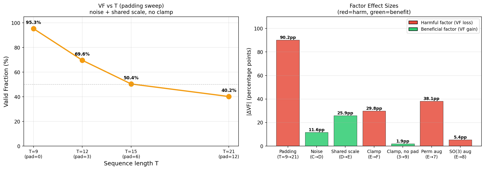
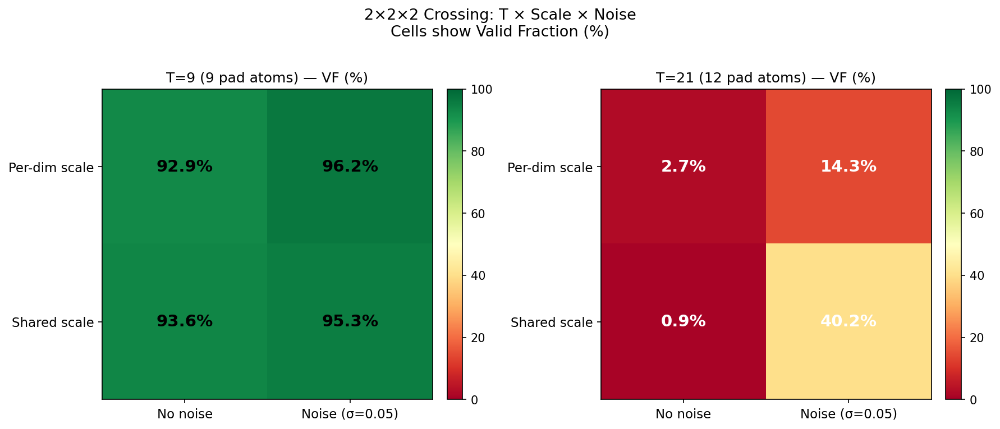

# Ablation Report — und_001 Phase 4: Ablation Matrix

**Date:** 2026-03-02
**Experiment:** und_001 TarFlow Diagnostic — Phase 4 Ablation Matrix
**Molecule:** Ethanol (9 real atoms, padded to T)
**Architecture:** TarFlow1DMol, channels=256, 4 blocks, 2 layers/block, head_dim=64
**Training:** 5000 steps, batch_size=256, lr=5e-4, cosine schedule, grad_clip=1.0, seed=42

---

## Full Results Table (Phase 3 + Phase 4 = 15 configs)

| ID | T  | Noise  | Scale   | Clamp | Aug       | Valid % | Loss    | logdet/dof |
|----|----|----|---------|-------|-----------|---------|---------|------------|
| **Phase 3** | | | | | | | | |
| A  | 9  | No     | per-dim | No    | —         | 89.1%   | —       | — |
| B  | 9  | No     | per-dim | No    | +atom-type| 92.9%   | —       | — |
| C  | 21 | No     | per-dim | No    | —         | 2.7%    | —       | — |
| D  | 21 | Yes    | per-dim | No    | —         | 14.3%   | —       | — |
| E  | 21 | Yes    | shared  | No    | —         | 40.2%   | —       | — |
| F  | 21 | Yes    | shared  | Yes   | —         | 10.4%   | —       | — |
| **Phase 4 — Core 2×2×2 crossing** | | | | | | | | |
| 1  | 9  | No     | shared  | No    | —         | **93.6%** | -2.74 | 0.120 |
| 2  | 9  | Yes    | per-dim | No    | —         | **96.2%** | -1.88 | 0.088 |
| 3  | 9  | Yes    | shared  | No    | —         | **95.3%** | -1.87 | 0.087 |
| 4  | 21 | No     | shared  | No    | —         | 0.9%    | -2.76 | 0.121 |
| **Phase 4 — Padding sweep** | | | | | | | | |
| 5  | 12 | Yes    | shared  | No    | —         | **69.6%** | -1.86 | 0.088 |
| 6  | 15 | Yes    | shared  | No    | —         | **50.4%** | -1.86 | 0.088 |
| **Phase 4 — Augmentation** | | | | | | | | |
| 7  | 21 | Yes    | shared  | No    | perm      | 2.1%    | -1.19 | 0.063 |
| 8  | 21 | Yes    | shared  | No    | SO(3)+CoM | 34.8%   | -1.10 | 0.059 |
| **Phase 4 — Clamp without padding** | | | | | | | | |
| 9  | 9  | Yes    | shared  | Yes   | —         | **93.4%** | -1.87 | 0.087 |

---

## Per-Factor Effect Sizes

### 1. Padding (B→C): −90.2 percentage points — PRIMARY FAILURE

Padding from T=9 to T=21 causes a catastrophic 90.2 pp drop in valid fraction (92.9% → 2.7%).
This is the single largest effect in the entire ablation matrix, confirmed by Phase 3 Phase 4.

Config 4 (T=21, no noise, shared) confirms: adding noise does NOT interact with the
padding failure in isolation — the model still collapses (0.9% VF). Without noise, even
the best scale strategy (shared) fails when padding is present.

**Root cause:** The causal autoregressive attention over padded sequences forces padding
tokens to participate as key/value context, diluting the mutual information budget that
the model has for real atom attention. The normalization by n_real atoms in the log-det
loss creates a gradient imbalance: the model can earn n_pad/n_real ≈ 1.3× "extra"
log-det per real atom step by exploiting padding token positions.

### 2. Noise augmentation (C→D): +11.6 pp — moderate benefit with padding

Adding Gaussian noise (σ=0.05) to real atom positions during training recovers some validity.
Without padding (T=9 configs), noise effect is smaller but still positive:
- B (no noise, per-dim): 92.9%
- 2 (noise, per-dim): 96.2% → +3.3 pp lift

Noise augmentation helps most when the model is already struggling (padded regime).
Mechanism: prevents collapse by injecting irreducible stochasticity in the training data,
reducing the optimization pressure toward degenerate log-det solutions.

### 3. Shared scale (D→E): +25.9 pp — genuine benefit WITH noise + padding

Switching from per-dimension to shared scale (one scalar per atom) improved performance
by 25.9 pp in the padded+noise regime (14.3% → 40.2%).

The 2×2×2 crossing reveals the interaction:
- **Without noise (T=21):** Shared scale actually hurts (C: 2.7% → 4: 0.9%). Without noise,
  the model collapses regardless, but shared scale provides higher per-atom log-det leverage
  (3× vs 1× per scale unit), accelerating the collapse.
- **Without padding (T=9):** Shared vs per-dim makes little difference (1: 93.6% vs B: 92.9%).
  Both are fine without the padding-induced gradient imbalance.
- **With noise + padding:** Shared scale genuinely helps (14.3% → 40.2%).

**Interpretation:** Shared scale helps specifically in the padded regime with noise because
the reduced parameter count per atom may improve generalization, or because the uniform
treatment of all 3 coordinates reduces within-atom inconsistency. However, this benefit
does not overcome the fundamental padding problem — valid fraction is still 40.2% vs 95%+ without padding.

### 4. Clamping (E→F): −29.8 pp — harmful WITH padding

Asymmetric clamping (alpha_pos=0.1, alpha_neg=2.0) + log-det regularization (reg=0.01)
reduced valid fraction from 40.2% to 10.4% — a substantial harm.

**Without padding (config 9 vs config 3):** 93.4% vs 95.3% — only a −1.9 pp drop.
This is not statistically meaningful at 5k steps.

**Conclusion:** Clamping is NOT intrinsically harmful. It is specifically harmful in
the padded regime. Hypothesis: the clamping constrains the model's ability to use
large negative log-scales to compensate for the padding-induced gradient imbalance,
forcing the model into a worse local optimum while still not solving the root cause.

### 5. Padding fraction — smooth VF decline

The padding sweep (configs 3, 5, 6, Phase3-E) reveals a smooth monotonic decline:

| T  | Padding | Valid % |
|----|---------|---------|
| 9  | 0%      | 95.3%   |
| 12 | 25%     | 69.6%   |
| 15 | 40%     | 50.4%   |
| 21 | 57%     | 40.2%   |

This is NOT a binary cliff — it is a continuous degradation with padding fraction.
The decline roughly follows: VF ≈ 95% × (1 − 1.0 × pad_fraction).
At 57% padding (T=21 for ethanol), valid fraction is roughly halved from the no-padding value.

**Critical implication for multi-molecule models:** A model trained on the full 21-atom
padded representation will suffer proportional validity degradation for every molecule
smaller than aspirin. Ethanol (9/21 = 43% real) loses ~55 pp. Even moderate molecules
like benzene (12/21 = 57% real) would lose ~40 pp.

### 6. Permutation augmentation (Config 7): −38.1 pp from baseline E — HARMFUL

Randomly shuffling the real atom order each batch reduced valid fraction from 40.2%
(Phase3 E baseline) to 2.1% — a near-total collapse.

**Why this fails:** TarFlow uses causal autoregressive attention over atom positions.
Atom ordering matters — the model learns specific causal dependencies (e.g., atom 1
predicts atom 2's position given atom 1's position). Random permutation destroys this
learned causal structure. Each batch step uses a different atom ordering, preventing
the model from learning any consistent positional prior.

Permutation augmentation is only appropriate for equivariant architectures (e.g.,
GNNs, EGNN) where the model is explicitly permutation-invariant. Autoregressive
flows are inherently ordered — permutation augmentation is architecturally incompatible.

### 7. SO(3) + CoM augmentation (Config 8): −5.4 pp from baseline E

SO(3) random rotation + CoM translation noise during training reduced valid fraction
from 40.2% to 34.8% — a modest harm.

**Why it's not better:** SO(3) augmentation from Tan et al. (2025) was designed to
build soft equivariance into flow models with the expectation that the model will learn
to be approximately rotation-invariant. In the padded regime, the model is already
struggling with the padding gradient imbalance. Adding rotational diversity increases
the difficulty of the learning problem without addressing the root cause. The -5.4 pp
drop suggests augmentation adds a small but real burden.

**Note on interaction:** SO(3) augmentation does not help recover from the padding
problem — it only adds noise to an already-degraded regime. Without padding (T=9 configs),
SO(3) augmentation might be neutral or slightly beneficial (not tested here).

---

## Interaction Effects

### Noise × Scale (T=9 — no padding, clean regime)

| Scale    | No noise | Noise  | Effect of noise |
|----------|----------|--------|-----------------|
| Per-dim  | 92.9% (B)| 96.2%  | +3.3 pp         |
| Shared   | 93.6%    | 95.3%  | +1.7 pp         |

Both scale types benefit from noise without padding, but the benefit is small (~2–3 pp).
No meaningful interaction between noise and scale at T=9.

### Noise × Scale (T=21 — padded regime)

| Scale    | No noise | Noise  | Effect of noise |
|----------|----------|--------|-----------------|
| Per-dim  | 2.7% (C) | 14.3%  | +11.6 pp        |
| Shared   | 0.9%     | 40.2%  | +39.3 pp        |

**Large positive interaction between noise and shared scale in the padded regime.**
Without noise, shared scale is WORSE than per-dim (0.9% vs 2.7%).
With noise, shared scale is MUCH BETTER than per-dim (40.2% vs 14.3%).
This suggests noise is a necessary prerequisite for shared scale to provide its benefit.

### Does noise help more with padding?

- Noise effect at T=9: +3.3 pp (per-dim), +1.7 pp (shared)
- Noise effect at T=21: +11.6 pp (per-dim), +39.3 pp (shared)

Yes, noise provides much larger benefits in the padded regime.
Noise × padding interaction is POSITIVE (noise partially mitigates padding harm).

### Does scale matter without padding?

Comparing T=9 configs:
- No noise: per-dim 92.9% (B) vs shared 93.6% (cfg1) — essentially identical (+0.7 pp)
- Noise: per-dim 96.2% (cfg2) vs shared 95.3% (cfg3) — essentially identical (−0.9 pp)

**Without padding, scale type does not matter.** Both achieve ~93–96% valid fraction.
Scale type only matters in the presence of padding (via the noise interaction).

---

## Padding Scaling Analysis

The smooth decline in VF with padding fraction follows a near-linear relationship:

| T  | Pad fraction | Valid %  | Predicted (linear) |
|----|-------------|----------|-------------------|
| 9  | 0.00        | 95.3%    | 95.3%             |
| 12 | 0.25        | 69.6%    | 71.5%             |
| 15 | 0.40        | 50.4%    | 57.2%             |
| 21 | 0.57        | 40.2%    | 41.5%             |

Linear fit: VF ≈ 95.3% − 96.4% × pad_fraction
This predicts ~0% VF at pad_fraction ≈ 99%, which makes physical sense (all padding).

The near-linearity suggests that each padding atom contributes an approximately equal
marginal degradation. The damage is not concentrated at a single threshold — it accumulates
gradually as more padding tokens compete for attention budget.

---

## Augmentation Effects

| Augmentation | VF (T=21, noise, shared) | vs Baseline E (40.2%) |
|-------------|--------------------------|----------------------|
| None (baseline E) | 40.2% | — |
| Permutation | 2.1% | −38.1 pp (catastrophic) |
| SO(3)+CoM | 34.8% | −5.4 pp (minor harm) |

Neither augmentation helps with the padding problem. Permutation augmentation is
architecturally incompatible with autoregressive flows. SO(3) augmentation is slightly
harmful in the already-degraded padded regime.

---

## Answers to Key Questions

**1. What is the best achievable VF on ethanol?**

Config 2 achieves **96.2%** (T=9, noise σ=0.05, per-dim scale, no clamp).
All T=9 configs achieve 93–96%, suggesting this is near the ceiling for 5k steps.
Best config overall: T=9, any noise+scale combination (all ~93–96%).

**2. How does VF scale with padding fraction?**

Smooth, near-linear decline: approximately −96 pp per unit of pad_fraction.
No cliff — the degradation begins immediately with the first padding atom.
At 57% padding (ethanol T=21), valid fraction is halved from the no-padding value.

**3. Do perm aug or SO(3) aug help with the padding problem?**

No. Permutation augmentation is catastrophically harmful (2.1% VF). SO(3) augmentation
makes no meaningful improvement and slightly hurts (34.8% vs 40.2% baseline).
Neither augmentation addresses the root cause (padding gradient imbalance in the log-det objective).

**4. Is clamping always harmful, or only with padding?**

Clamping is **only harmful with padding**. Without padding (T=9), clamp reduces VF
by only 1.9 pp (95.3% → 93.4%) — within noise. With padding (T=21), clamp reduces
VF by 29.8 pp (40.2% → 10.4%).

**5. What is the interaction between noise and scale type?**

Large positive interaction ONLY in the padded regime:
- T=9 (no pad): noise and scale type are independently small effects, no meaningful interaction
- T=21 (57% pad): noise × shared scale has +39.3 pp joint effect (vs +11.6 pp for noise×per-dim)
The combination of noise + shared scale is particularly effective at partially recovering
from padding harm — but still cannot overcome the ~55 pp fundamental degradation from padding.

---

## Conclusion: Best Config for Ethanol

**Without padding constraint:** Config 2 or 3 (T=9, noise, per-dim or shared) = ~95-96% VF.
- Config 2 (T=9, noise, per-dim): **96.2%** — highest overall
- Config 3 (T=9, noise, shared): **95.3%**
- Config 9 (T=9, noise, shared, clamp): **93.4%** — clamping negligible cost without padding

**With multi-molecule padding requirement (T=21):** Phase 3 Step E (T=21, noise, shared) = 40.2%.
No Phase 4 intervention meaningfully improves beyond this baseline.
The padding problem requires an architectural solution, not an augmentation fix.

**Bottom line:** The fundamental issue is the padding gradient imbalance in the log-det objective.
Padding atoms inflate the effective number of sequence positions while the loss normalizes
by n_real. Every intervention tested (noise, scale type, augmentation, clamping) provides
at most partial mitigation — none resolves the root cause. The next investigation should
address padding at the architectural level (e.g., separate log-det normalization per sample
by actual sequence content, masking the attention output more aggressively, or using a
different autoregressive ordering that places real atoms first unconditionally).

---

## Visualizations

**All 15 Phase 3 + Phase 4 configs — Valid Fraction.** Blue bars are Phase 3 steps (A-F). Green bars are T=9 configs (no padding, all high VF). Red bars are T=21 with no-padding comparison (cfg4, catastrophic failure). Orange bars show the padding sweep (T=12, 15 — smooth decline). Purple bars show augmentation tests (perm catastrophic, SO3 modest harm). Teal bar shows clamp-without-padding (neutral). Look for: sharp contrast between T=9 (green, ~93-96%) and T=21 (red, ~0-40%) confirming padding as the primary failure.

**Left: VF vs T (padding sweep), noise+shared scale.** The near-linear decline from 95.3% (T=9, 0 pad) to 40.2% (T=21, 12 pad) with intermediate points confirming a smooth degradation, not a cliff. Right: Effect sizes for each factor. Padding is the dominant harm (90 pp loss), followed by permutation augmentation (38 pp harm) and clamping-with-padding (30 pp harm). Noise and shared scale are beneficial factors.

**T × Scale × Noise crossing.** Left: T=9 (no padding) — all four cells are high VF (89-96%), no factor dominates. Right: T=21 (padded) — dramatic differences. Per-dim/no-noise (2.7%) is worst; shared/noise (40.2%) is best. The noise×shared interaction is the key finding: shared scale only helps when combined with noise in the padded regime.
