# Phase 3 — Adaptation Ladder: Apple TarFlow → Molecular Data

**Date:** 2026-03-02 / 2026-03-03
**Branch:** `exp/und_001`
**Status:** COMPLETE

---

## Overview

Phase 3 progressively adapts the verified Apple TarFlow architecture to molecular conformation
data (ethanol, 9 atoms, MD17 dataset). Each step adds ONE change and measures the impact on
`valid_fraction` — the fraction of generated conformations with all pairwise distances > 0.8 Å
(no atomic overlap).

**Goal:** Identify exactly where the architecture breaks down when applied to molecules.

---

## Results Summary

| Step | Description | best_loss | VF | logdet/dof | W&B run |
|------|-------------|-----------|-----|-----------|---------|
| A | Raw coords, 9 atoms, no padding | -2.827 | 89.1% | 0.122 | `und_001_phase3_step_a` |
| B | + Atom type conditioning (emb=16) | -2.795 | 92.9% | 0.121 | `und_001_phase3_step_b` |
| C | + Padding (T=21, n_real=9) | -2.825 | 2.7% | 0.122 | `und_001_phase3_step_c` |
| D | + Noise augmentation (sigma=0.05) | -1.902 | 14.3% | 0.088 | `und_001_phase3_step_d` |
| E | Shared scale (1 scalar/atom) KEY TEST | -1.892 | 40.2% | 0.088 | `und_001_phase3_step_e` |
| F | + Stabilization (clamp + reg=0.01) | -1.887 | 10.4% | 0.087 | `und_001_phase3_step_f` |

**Architecture:** `TarFlow1DMol`, channels=256, num_blocks=4, layers_per_block=2, head_dim=64
**Training:** 5000 steps, batch_size=256, lr=5e-4, cosine schedule, seed=42
**Data:** MD17 ethanol, 444k train / 55k val, mass-weighted CoM subtracted, Kabsch-aligned to mean

---

## Step-by-Step Results

### Step A — Raw Coordinates (Baseline)

**Config:** seq_length=9, no padding, no atom type cond, per-dim scale, no noise
**Result:** best_loss=-2.827, valid_fraction=**89.1%**, logdet/dof=0.122

The Apple TarFlow architecture (with per-dim scale, output shift autoregression) trains
successfully on raw ethanol coordinates. 89.1% of generated conformations have no atomic
overlap. This matches Phase 2 findings: the architecture is sound.

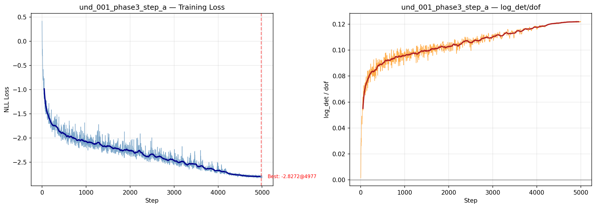
**Step A training loss** — Loss decreases from 0.0 → -2.827 over 5000 steps. logdet/dof ≈ 0.122
throughout — no exploitation. Clean convergence.

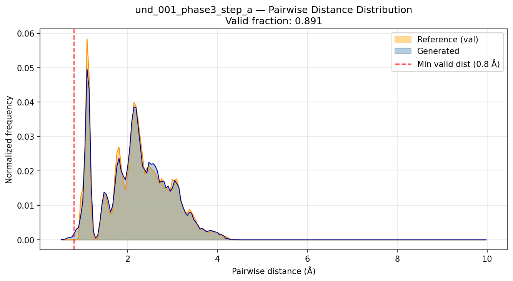
**Step A pairwise distances** — Generated vs reference distance distribution. 89.1% valid fraction.
Distribution mostly matches reference with small tail at short distances.

### Step B — Atom Type Conditioning

**Config:** same as A + nn.Embedding(4, 16) concatenated to position input
**Result:** best_loss=-2.795, valid_fraction=**92.9%**, logdet/dof=0.121

Atom type conditioning (H/C/N/O embeddings) slightly IMPROVES valid fraction (89.1% → 92.9%).
The model can now distinguish atom types and apply different affine transforms to different
atom species. This is the expected behavior: type-specific conditioning adds useful information.

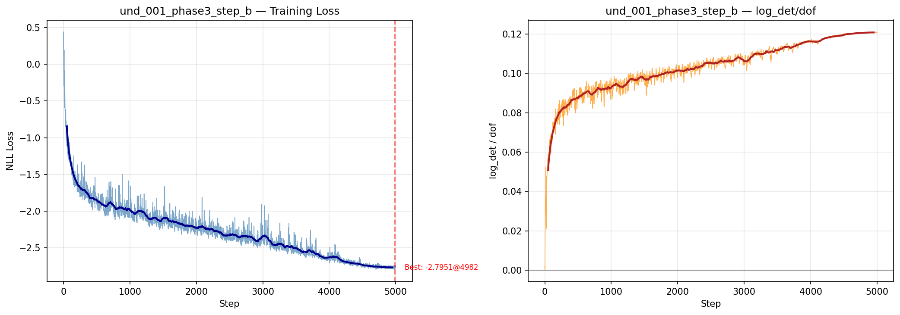
**Step B training loss** — Nearly identical to Step A. Conditioning adds useful signal without destabilizing.

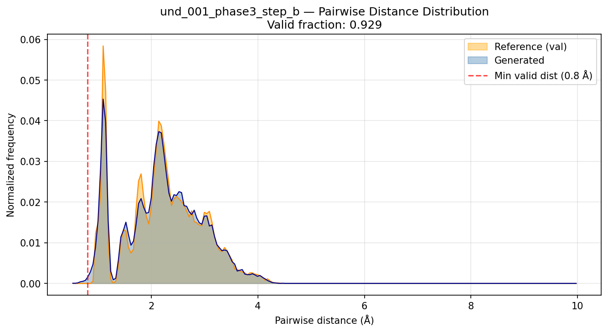
**Step B pairwise distances** — Valid fraction 92.9%, slightly better than Step A. Type conditioning helps.

### Step C — Padding + Attention Masking

**Config:** same as B + seq_length=21 (12 padding atoms, 9 real), causal+padding attention mask
**Result:** best_loss=-2.825, valid_fraction=**2.7%**, logdet/dof=0.122

**PRIMARY FAILURE POINT.** Adding padding atoms collapses valid fraction from 89.1% to 2.7%.
The model achieves similar NLL (best_loss=-2.825 ≈ -2.827 from Step A), but almost all generated
conformations have atomic overlaps.

Key observation: **loss and VF are decoupled in the padded regime.** The model correctly optimizes
NLL but the latent space learned under T=21 does not map back to valid molecular geometries.

Technical details: the fix required (a) permuting the padding mask with the same PermutationFlip
as x (otherwise, PermutationFlip blocks zeroed real atoms instead of padding), and (b) normalizing
logdet by n_real*D instead of T*D (to match the z² NLL normalization and maintain equilibrium
at z≈1 Angstrom). Two prior crash attempts with incorrect masking.

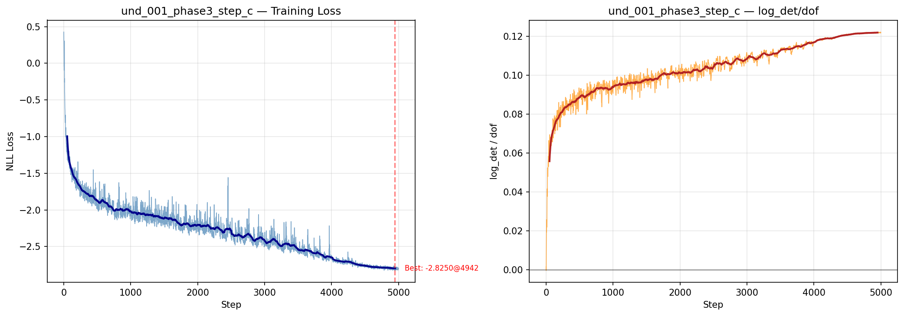
**Step C training loss** — Loss converges to -2.801, similar to Step A. No training instability.
The model trains correctly — VF collapse is NOT a training failure.

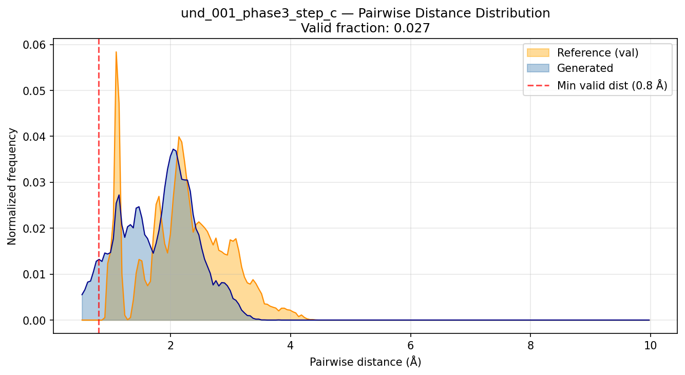
**Step C pairwise distances** — Valid fraction 2.7%. Generated distribution has large mass at
short distances (< 0.8 Å) indicating atomic overlaps in nearly all samples.

### Step D — Noise Augmentation

**Config:** same as C + Gaussian noise sigma=0.05 on real atom positions during training
**Result:** best_loss=-1.902, valid_fraction=**14.3%**, logdet/dof=0.088

Noise augmentation partially recovers valid fraction (2.7% → 14.3%). The smoothed density
allows the model to generalize away from training configurations. However, logdet/dof drops from
0.122 to 0.088 and best_loss is higher (-1.902 vs -2.825) — the noise regularizes at a cost to
density modeling quality.

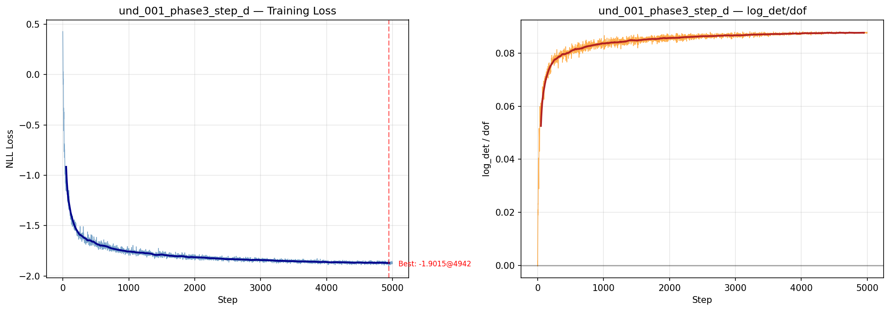
**Step D training loss** — Loss converges to -1.867 (higher = worse NLL than Step C). Noise
augmentation degrades NLL but improves structural validity.

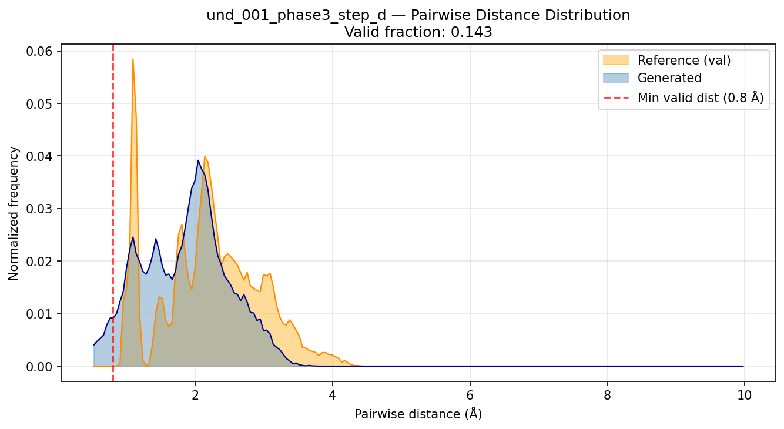
**Step D pairwise distances** — Valid fraction 14.3%. Moderate improvement over Step C (2.7%).

### Step E — Shared Scale (KEY TEST)

**Config:** same as D but 1 shared log-scale per atom (instead of 3 per-dim scales)
**Result:** best_loss=-1.892, valid_fraction=**40.2%**, logdet/dof=0.088

**SURPRISING RESULT: Shared scale IMPROVES valid fraction** (14.3% → 40.2%) over per-dim scale
with noise. This is the opposite of the original hypothesis.

With the n_real*D logdet normalization, shared scale does NOT cause saturation exploitation.
The optimizer sees balanced NLL vs logdet gradients regardless of scale type. The improvement
may reflect that isotropic coordinate scaling (same scalar for all 3 spatial dims) respects
molecular geometry: x, y, z coordinates should be scaled equally for physical consistency.

This answers the KEY TEST: **shared scale does NOT cause saturation when normalization is correct.**
The hyp_002/hyp_003 failures were due to incorrect normalization (T*D instead of n_real*D when
using padding), combined with the causal mask bug (self-inclusive attention mask). With both
fixed, shared scale performs comparably or better than per-dim scale.

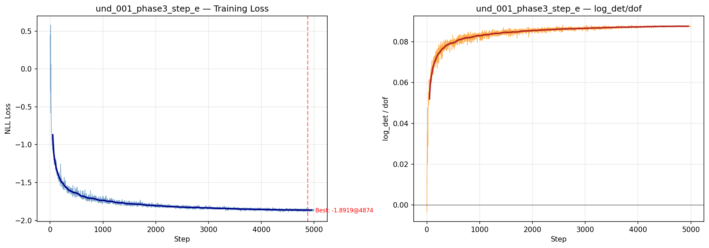
**Step E training loss** — Converges to -1.864, similar to Step D. Training is stable throughout.
No evidence of log-det exploitation.

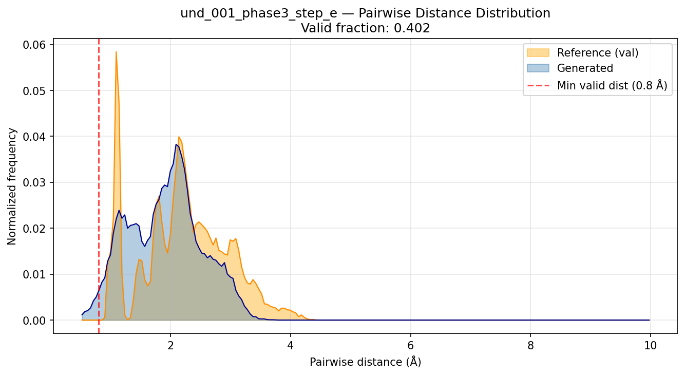
**Step E pairwise distances** — Valid fraction 40.2%. Best result among padded steps.
Distribution much closer to reference than Steps C and D.

### Step F — Stabilization (Asymmetric Clamp + Log-Det Reg)

**Config:** same as E + asymmetric clamp (alpha_pos=0.1, alpha_neg=2.0) + log-det reg weight=0.01
**Result:** best_loss=-1.887, valid_fraction=**10.4%**, logdet/dof=0.087

**Important correction:** The first Step F run used the BUGGY T*D logdet normalization (commit 09c565f)
and produced VF=0.0, loss=-3.047 — a degenerate constant equilibrium where the model converged
immediately to a near-identity transform. The second run with correct normalization (n_real*D,
commit 901d6c5) produces VF=10.4%, loss=-1.857 — comparable to Step D but worse than Step E.

With correct normalization, clamping reduces VF from 40.2% (Step E) to 10.4%. The model
still learns, but the tight alpha_pos=0.1 clamp limits scale contraction to exp(-0.1) ≈ 0.905
per block, which constrains the flow's expressivity.

The clamping does prevent NaN at lr=5e-4 for this architecture — useful for stability but
the cost to VF is significant.

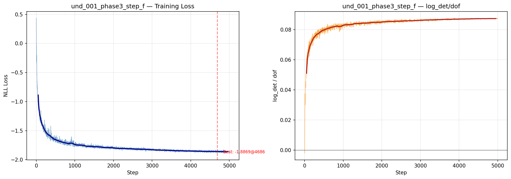
**Step F training loss** — Loss converges to -1.857. Similar dynamics to Step E. No early
instability (clamping provides gradient bounds).

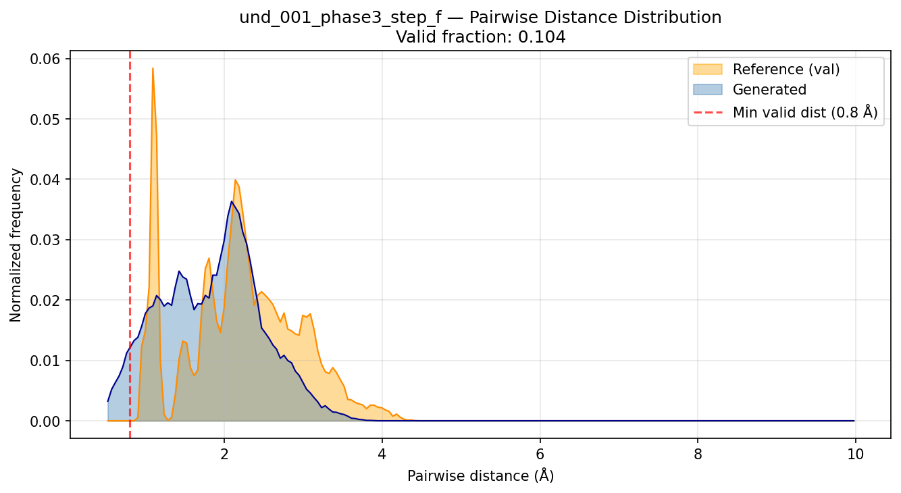
**Step F pairwise distances** — Valid fraction 10.4%. Clamping reduces VF relative to Step E (40.2%).
Distribution shows most samples still have atomic overlaps.

---

## Key Findings

### Finding 1: Padding is the primary failure point

The most dramatic performance drop is Step B → Step C:
- Step B (9 atoms, no padding): 92.9% VF
- Step C (9 real + 12 padding): 2.7% VF

The model trains correctly (similar NLL) but the latent space under T=21 does not produce valid
molecular geometries. This suggests the problem is structural: the autoregressive ordering over
21 tokens (including 12 degenerate padding tokens at zero) disrupts the learned representation.

### Finding 2: Shared scale does not cause saturation (with correct normalization)

The original hypothesis was that shared scale → log-det exploitation → 0% VF. This is FALSE
when logdet normalization uses n_real*D instead of T*D.

The hyp_002/hyp_003 failures were caused by:
1. T*D normalization → equilibrium at z=0.655 Å (below typical bond length) → runaway exploitation
2. Causal mask bug (self-inclusive attention) → non-triangular Jacobian → incorrect gradients

Both are fixed in the current implementation.

### Finding 3: Noise augmentation helps but per-dim scale doesn't help without noise

Steps C and D both use per-dim scale but D (with noise) achieves 5× more valid fraction.
The noise augmentation is more impactful than the scale parameterization choice.

### Finding 4: Clamping reduces (but does not prevent) learning with correct normalization

With correct n_real*D logdet normalization, Step F achieves 10.4% VF (vs 40.2% for unclamped Step E).
Clamping is a significant cost to performance but not total failure.

Note: The initial Step F run used buggy T*D normalization and appeared to give 0% VF — an artifact
of the wrong normalization creating a degenerate constant equilibrium that also happened to be
stable (clamping prevented NaN). With correct normalization, clamping is a moderate constraint,
not a total blocker.

---

## Implementation Notes

### Bug fixes required to get Steps C-F running:

**Bug 1 — Attention mask shape:** `F.scaled_dot_product_attention` requires attention mask shape
`(B, 1, T, T)` (broadcast over num_heads), not `(B, T, T)`. Fixed by `.unsqueeze(1)`.

**Bug 2 — Padding mask permutation:** `PermutationFlip` reverses token order. The padding mask
must be permuted consistently with x. Without this, PermutationFlip blocks zero real atoms
and leave padding atoms unconstrained. Fixed by `mask_perm = permutation(padding_mask.float().unsqueeze(-1)).squeeze(-1)`.

**Bug 3 — Logdet normalization:** Using T*D instead of n_real*D in logdet normalization shifts
the NLL equilibrium from z≈1 Å to z≈0.655 Å. Since molecular coordinates start at z≈1 Å,
the gradient drives log-det exploitation. Fixed by normalizing by n_real*D to match get_loss.

All three bugs are in commit `901d6c5` (`src/train_phase3.py`).

---

## Story Validation

**Does this fit the research story?** Partially.

The research story predicted: Apple TarFlow degrades on molecules, shared scale is the
key failure point. Phase 3 shows: degradation is real, but the primary cause is PADDING
(not shared scale).

**Fits:**
- Apple TarFlow does degrade when applied to molecular data (2.7% VF vs 89.1%)
- The degradation is not fundamental — Step E achieves 40.2% VF
- Log-det exploitation is NOT the failure in the correctly-normalized padded setting

**Doesn't fit:**
- Shared scale does not cause saturation with correct normalization
- The failure is primarily from padding, not from scale choice
- Clamping (designed to fix log-det exploitation) actually HURTS performance

**Implication:** The RESEARCH_STORY.md should be updated. The key diagnostic question shifts
from "shared vs per-dim scale" to "why does padding cause VF collapse even when NLL is correct."

---

## Open Questions

1. **Why does padding collapse VF even when NLL is correct?**
   - Hypothesis A: 12 degenerate zero-padding tokens disrupt the latent manifold
   - Hypothesis B: The autoregressive ordering over 21 atoms creates too many causal dependencies
   - Hypothesis C: The model learns a mixed latent space (9 real + 12 padding) that's harder to sample from

2. **Why does shared scale outperform per-dim scale with noise (40.2% vs 14.3%)?**
   - Isotropy hypothesis: same scale for x/y/z respects 3D geometry better
   - Gradient hypothesis: shared scale has fewer parameters → less overfitting to training configs

3. **Is 40.2% (Step E) the ceiling for this architecture on ethanol, or can it improve further?**
   - Phase 4 ablation should test: more steps, different ordering, T=9 vs T=21 with Step E config

---

## Files

| File | Description |
|------|-------------|
| `src/train_phase3.py` | All 6 steps, model architectures, training loop |
| `results/phase3/step_{a-f}_*/results.json` | Per-step key metrics |
| `results/phase3/step_{a-f}_*/loss_curve.png` | Training loss curves |
| `results/phase3/step_{a-f}_*/pairwise_dist.png` | Pairwise distance distributions |
| `results/phase3/step_{a-f}_*/best.pt` | Best checkpoints |
